# 🤝 Collaborative Engineering Team Agents
> **Experimental Repository**: The methodologies and opinions expressed herein are those of individual contributors and do not represent any organization's views.

This collaborative agent system was developed based on learnings from experimental multi-agent research documented in:
- [Beyond Vibe Coding: A Multi-Agent Approach to Software Engineering](https://www.appliedcontext.ai/p/beyond-vibe-coding-a-multi-agent)
- Github: [https://github.com/niksacdev/multi-agent-system](https://github.com/niksacdev/multi-agent-system)

**Reference Implementation**: These agents were extracted and generalized from end-to-end development in [loan-defenders](https://github.com/niksacdev/loan-defenders), where they were used for feature development, code reviews, and architecture decisions. The patterns and optimizations documented here reflect practical lessons from that work.

## 🎯 The Approach

**Traditional AI**: Single assistant, generic responses, no persistent knowledge
**Our Approach**: **Specialized team members** that collaborate, create documentation, and build institutional knowledge

### Team Collaboration in Action

```mermaid
graph TD
    PM[Product Manager<br/>📊 Requirements & Business Value]
    UX[UX Designer<br/>🎨 User Journeys & Accessibility]
    ARCH[System Architect<br/>🏛️ ADRs & System Design]
    CODE[Code Reviewer<br/>🔍 Security & Quality]
    TECH[Technical Writer<br/>✍️ Documentation & Content]
    AI[Responsible AI<br/>🌍 Bias & Compliance]
    DEVOPS[DevOps Specialist<br/>🚀 Deployment & Operations]

    PM -->|"Map user journey for this feature"| UX
    UX -->|"Any accessibility barriers?"| AI
    ARCH -->|"Security implications?"| CODE
    CODE -->|"Deployment concerns?"| DEVOPS
    AI -->|"Business impact assessment"| PM
    PM -->|"Document this feature"| TECH

    PM -.->|Creates| DOCS_P[docs/product/<br/>Requirements & Issues]
    UX -.->|Creates| DOCS_U[docs/ux/<br/>Journey Maps]
    ARCH -.->|Creates| DOCS_A[docs/architecture/<br/>ADRs]
    CODE -.->|Creates| DOCS_C[docs/code-review/<br/>Review Reports]
    TECH -.->|Creates| DOCS_T[docs/technical-writing/<br/>Guides & Tutorials]
    AI -.->|Creates| DOCS_R[docs/responsible-ai/<br/>RAI-ADRs]
    DEVOPS -.->|Creates| DOCS_D[docs/gitops/<br/>Deployment Guides]
```



Leverages Claude SubAgents and GitHub Copilot chatmodes, with universal AGENTS.md format for broad tool compatibility

## 🏢 Enterprise-Grade Collaborative Agents

**Enterprise-Ready Platforms**: [Claude Code](https://claude.ai/code) • [GitHub Copilot](https://github.com/features/copilot) • Plus universal AGENTS.md support for other AI tools

### 🏆 Enterprise Benefits
- **Security-First**: Guidance based on OWASP principles and secure coding practices
- **Audit Trail**: All agent decisions create persistent documentation
- **Accessibility Focused**: Guidance based on WCAG 2.1 principles and inclusive design
- **Scalable Patterns**: Architecture guidance for enterprise-scale considerations
- **Vendor Agnostic**: Works across multiple AI platforms and tools
- **Optimized Performance**: 75% token reduction (300-500 lines per agent) = 10x faster responses (30s → 3s)

### 🔄 Always Question-First Development

Every feature request follows this **collaborative workflow**:

1. **🔍 Product Manager** asks: "What user need does this solve? How do we measure success?"
2. **🎨 UX Designer** maps user journeys and validates accessibility requirements  
3. **🏛️ System Architect** ensures secure, scalable design and creates Architecture Decision Records
4. **🔍 Code Reviewer** validates security, reliability, and implementation quality
5. **🌍 Responsible AI** prevents bias and ensures inclusive, accessible design
6. **🚀 GitOps Specialist** optimizes deployment and operational excellence

**Result**: Every feature is **user-focused**, **well-architected**, **secure**, **accessible**, and **reliably deployed**.

### 🤝 Your Collaborative Engineering Team

Each agent creates **persistent documentation** and collaborates with teammates:


| Agent | Collaborative Role | Creates Documentation | Delegates To |
|-------|-------------------|---------------------|-------------|
| **📊 Product Manager** | Clarifies user needs, validates business value | `docs/product/` requirements, GitHub issues | UX Designer for user journeys |
| **🎨 UX Designer** | Maps user journeys, ensures accessibility | `docs/ux/` user journey maps, design reports | Responsible AI for WCAG compliance |
| **🏛️ System Architect** | Creates ADRs, validates security, reliablility, scalability | `docs/architecture/` ADRs, system designs | Code Reviewer for security review |
| **🔍 Code Reviewer** | Reviews security, quality, performance | `docs/code-review/` detailed review reports | DevOps for deployment concerns |
| **✍️ Technical Writer** | Creates documentation, blogs, tutorials, API docs | `docs/technical-writing/` documentation, guides | Product Manager for requirements clarity |
| **🌍 Responsible AI** | Prevents bias, ensures accessibility | `docs/responsible-ai/` RAI-ADRs, compliance tracking | UX Designer for accessibility validation |
| **🚀 GitOps Specialist** | Optimizes CI/CD, deployment reliability | `docs/gitops/` deployment guides, runbooks | Code Reviewer for security gates |

### 🔗 Cross-Agent Collaboration Examples

**Feature Development Flow:**
```
Feature Request → Product Manager (requirements) 
              → UX Designer (user journey) 
              → System Architect (technical design)
              → Code Reviewer (implementation quality)
              → Responsible AI (bias & accessibility check)
              → GitOps (deployment optimization)
```

**Complex Decision Making:**
- **Product Manager** to **UX Designer**: "Can you map the user journey for this checkout flow?"
- **UX Designer** to **Responsible AI**: "Any accessibility barriers with this interface design?"
- **System Architect** to **Code Reviewer**: "Security implications of this microservices approach?"
- **Code Reviewer** to **GitOps**: "Any deployment concerns with this database migration?"


## ⚡ Setup

### 1. Install Collaborative Agent System

```bash
# Clone the collaborative engineering template
git clone https://github.com/niksacdev/engineering-team-agents.git

# Navigate to YOUR project repository
cd /path/to/your-project

# Install collaborative agents for your IDE:
cp -r ../engineering-team-agents/.claude ./           # Claude Code agents (8 specialized agents)
cp -r ../engineering-team-agents/.github ./          # GitHub Copilot chatmodes + GitHub-specific agents
cp ../engineering-team-agents/AGENTS.md ./            # Universal AI tool support
cp ../engineering-team-agents/claude.md ./           # Collaborative instructions
```

**Windows users:** Replace `cp -r` with `xcopy /E /I` and `cp` with `copy`

### 2. Setup Documentation System

**Important**: Agents create persistent documentation in a structured `docs/` folder. 

```bash
# Create documentation structure (will be auto-populated by agents)
mkdir -p docs/{product,ux,architecture,code-review,technical-writing,responsible-ai,gitops,templates}

# Copy documentation templates
cp -r ../engineering-team-agents/docs/templates/* docs/templates/
```

**To customize documentation locations:**
1. Edit agent files in `.claude/agents/`, `.github/chatmodes/`, or `AGENTS.md`
2. Update the `docs/[folder]/` paths to your preferred locations
3. Ensure templates exist in your specified template directory

### 3. Initialize Your Domain-Specific Team

**🔑 Key Principle**: Agents learn your project through **repository documentation reference**, not hardcoded modifications. This creates a growing knowledge base that evolves with your project.

**🎯 Token Optimization Strategy**: When providing domain knowledge to agents, use **file paths and repository links** instead of copying content:
```
✅ "Business context: see docs/product/business-context.md"
✅ "Architecture decisions: docs/architecture/ADR-001-auth-strategy.md"  
✅ "User personas: docs/ux/user-personas.md"
❌ "Our users are small business owners who need...[500 words of copied content]"
```
This keeps agent instructions lean while providing comprehensive project knowledge access.

Each IDE has a collaborative initialization process that helps agents understand YOUR project:

| Platform | Support Level | Setup Guide | Key Features |
|----------|---------------|-------------|-------------|
| **Claude Code** | ⭐ Full | [Setup Guide](docs/setup/claude-setup.md) | Specialized agents via Task tool, ADR creation, cross-agent consultation |
| **GitHub Copilot** | ⭐ Full | [Setup Guide](docs/setup/github-copilot-setup.md) | Collaborative chatmodes, team handoffs, persistent documentation |
| **Other AI Tools** | ✅ Basic | [Setup Guide](docs/setup/universal-agents-setup.md) | Universal format for broad tool compatibility (not individually tested) |

**Support Levels Explained:**
- **⭐ Full Support**: Thoroughly tested, enterprise features, active development, comprehensive documentation
- **✅ Basic Support**: Universal AGENTS.md format provides basic collaborative patterns but not individually tested per tool

### 4. Examples

**Question-First Development Pattern:**
```bash
# 1. Always start with user needs (not technical solutions)
"Use product-manager-advisor: Add user authentication to our app"
→ PM creates requirements → asks UX for user journey → validates with Responsible AI

# 2. Design before building  
"Use ux-ui-designer: Map user journey for authentication flow"
→ UX maps journey → asks Architecture for technical constraints → creates documentation

# 3. Validate everything with specialists
"Use code-reviewer: Review this authentication implementation"  
→ Code Reviewer checks security → asks Architecture for system impact → creates review report
```

**Result**: Every interaction creates documentation and enables **cross-specialist collaboration** that builds institutional knowledge.


## 🤝 Contributing

We welcome contributions that enhance collaborative engineering practices:
- **Improve agent collaboration patterns** and cross-specialist workflows
- **Add new specialized agents** for specific domains or technologies
- **Enhance documentation templates** and knowledge persistence systems
- **Expand IDE platform support** with collaborative features
- **Report issues** and suggest improvements to team workflows

Please see our [Contributing Guide](CONTRIBUTING.md) for detailed information.

## 🔗 Related Projects

- [Claude Code Documentation](https://docs.anthropic.com/en/docs/claude-code)
- [GitHub Copilot Chat Modes](https://github.com/github/awesome-copilot/tree/main/chatmodes)
- [AGENTS.md Specification](https://github.com/openai/agents.md)

---
